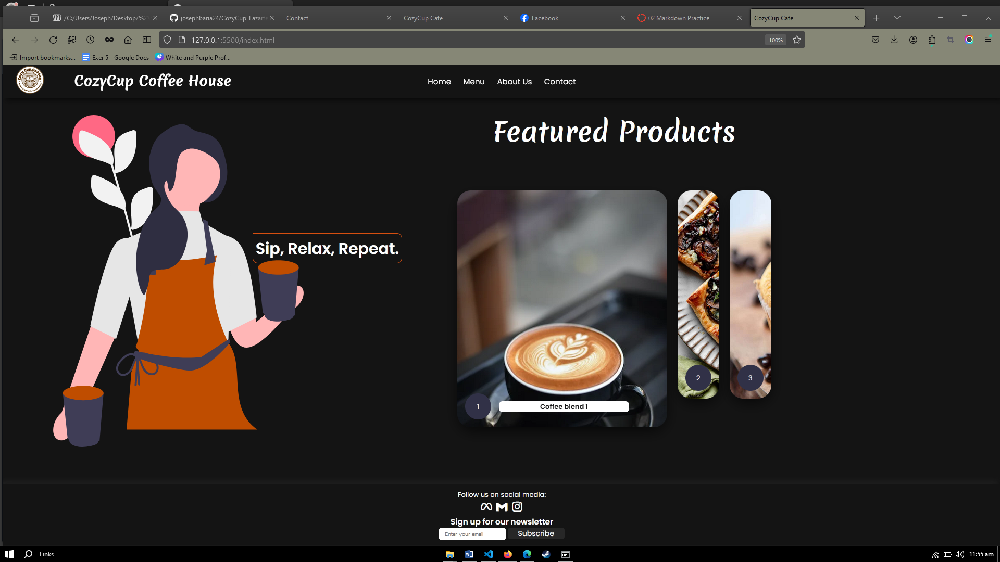
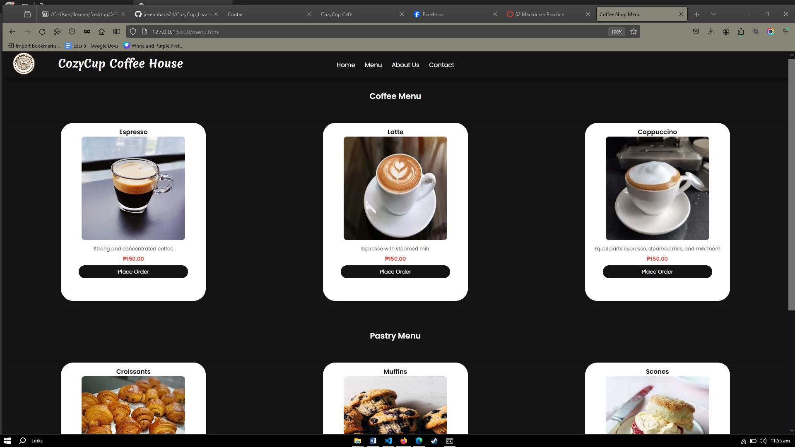
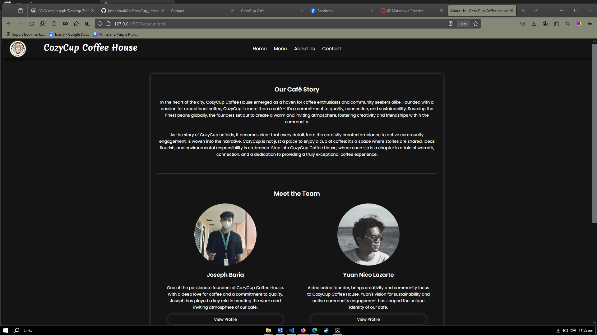
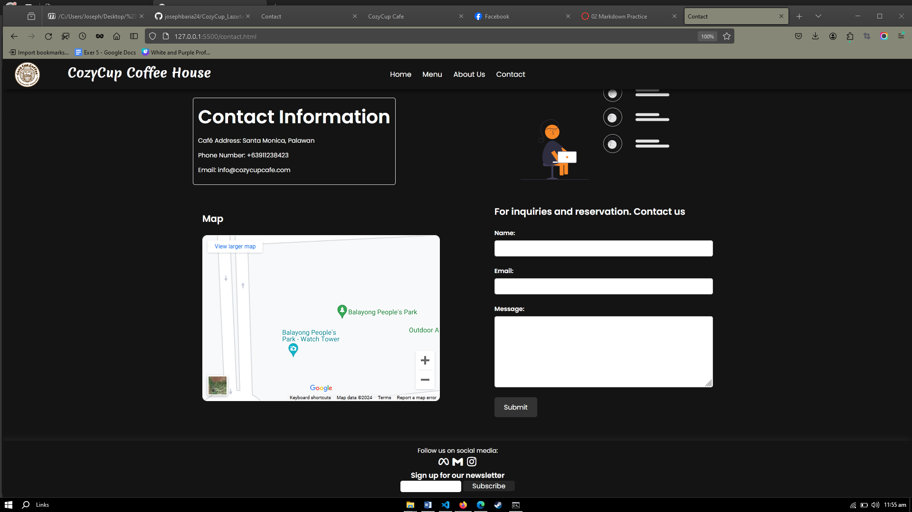

# Cozy Cup Cafe

## Project Description
Cozy Cup Cafe is a web project aimed at showcasing the menu, ambiance, and contact information of a cozy coffee house. It provides visitors with information about the cafe's offerings and allows them to get in touch easily.

## Features
- Home page with inviting hero section and featured products.
- Menu page displaying various coffee blends and pastries.
- About Us page featuring the cafe's story, team, and mission.
- Contact page with cafe's contact information and a form for inquiries.
- Embedded map showing the cafe's location.

## Screen Captures
1. 
   *This is the homepage showcasing the coffee blends and pastries.*
2. 
   *Menu showcasing various coffee blends and pastries.*
3. 
   *About Us page featuring the cafe's story and team.*
4. 
   *Contact page with contact information and a form for inquiries.*

## About the Authors

**Name:** Joseph Baria

**Email:** 202180024@psu.palawan.edu.ph

 

**Name:** Yuan Nico Lazarte

**Email:** 202080183@psu.palawan.edu.ph

 
